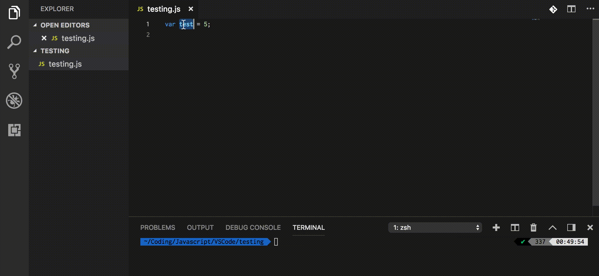

# JavaScript Quick Console

Quickly print out log messages

## Installing

This extension is available for free in the [Visual Studio Code Marketplace](https://marketplace.visualstudio.com/items?itemName=AhadCove.js-quick-console)

## How to use

#### Only activates with .py files

* Highlight anything in the editor
* Press Cmd+C (Mac), or Ctrl+C (Windows)
* The output (on a new line) will be: console.log('variable: ', variable);

## License
[MIT License](LICENSE)
